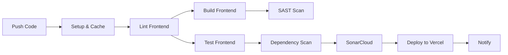

# F1 2025 Classification - Intelligent CI/CD Demo

<div align="center">


**A beautiful F1 classification dashboard demonstrating intelligent CI/CD practices**

[Live Demo](https://frontend-psi-liart-27.vercel.app/) • [View Pipeline](.github/workflows/ci-cd.yml) • [Report Bug](issues)

</div>

---

## Table of Contents

- [About](#about)
- [Features](#features)
- [Architecture](#architecture)
- [CI/CD Pipeline](#cicd-pipeline)
- [Technology Stack](#technology-stack)
- [Getting Started](#getting-started)
- [Feature Flag](#feature-flag)
- [Pipeline Steps](#pipeline-steps)
- [Academic Context](#academic-context)

---

## About

This project showcases an **intelligent CI/CD pipeline** with **9+ automated steps** for a frontend application displaying Formula 1 2025 driver championship standings. Built as part of an MBA assignment on modern DevOps practices.

### Key Highlights

 **9+ Pipeline Steps** - Exceeding assignment requirements  
 **Feature Flag Implementation** - Runtime configuration demo  
 **Comprehensive Testing** - Unit tests with high coverage  
 **Security First** - SAST and dependency scanning  
 **Quality Gates** - SonarCloud integration  
 **Zero-Downtime Deploy** - Automated Vercel deployment  

---

## Features

### Application Features

- **F1 2025 Classification** - Beautiful, responsive standings table with country flags
- **Official F1 Design** - Matching official F1 website styling
- **Modern UI/UX** - F1-themed design with Tailwind CSS
- **Feature Flag System** - `VITE_RUBINHO_CAMPEAO` toggle
- **Responsive Design** - Works on all devices
- **Fast Performance** - Vite-powered frontend with local data

### DevOps Features

- **Automated Deployment** - Push to main = instant production
- **Automated Testing** - Frontend unit tests with Vitest
- **Code Quality** - ESLint for TypeScript/JavaScript
- **Security Scanning** - CodeQL + npm audit
- **Code Analysis** - SonarCloud integration
- **Coverage Reports** - Visual coverage tracking
- **Parallel Execution** - Optimized pipeline runtime

---

## Architecture

```
┌─────────────────┐
│   User Browser  │
└────────┬────────┘
         │
    HTTPS│ (Vercel CDN)
         │
┌────────▼────────────────────────┐
│      Vercel Edge Network        │
│                                 │
│          Frontend               │
│        (React/Vite)             │
│                                 │
│  • UI Layer                     │
│  • State Management             │
│  • Components                   │
│  • Local Data                   │
│  • Feature Flags                │
└─────────────────────────────────┘
```

### Directory Structure

```
f1-classification-cicd/
├── .github/
│   └── workflows/
│       └── ci-cd.yml              # 9-step CI/CD pipeline
├── frontend/                       # React + Vite
│   ├── src/
│   │   ├── components/            # React components
│   │   ├── data/                  # Classification data + feature flags
│   │   ├── services/              # Data service layer
│   │   └── test/                  # Unit tests
│   ├── vercel.json                # Vercel deployment config
│   └── package.json
└── README.md
```

---

## CI/CD Pipeline

Our intelligent pipeline includes **9 automated steps**:

### Pipeline Stages



### Step Breakdown

| # | Step | Description | Tools |
|---|------|-------------|-------|
| 1 | **Checkout** | Clone repository | GitHub Actions |
| 2 | **Setup & Cache** | Configure Node.js + cache dependencies | actions/setup-node, actions/cache |
| 3 | **Lint** | ESLint + TypeScript checks | ESLint |
| 4 | **Build** | Compile React app | Vite |
| 5 | **Test** | Unit tests + coverage | Vitest |
| 6 | **SAST** | Static security analysis | GitHub CodeQL |
| 7 | **Dependency Scan** | Vulnerability detection | npm audit |
| 8 | **Code Quality** | Quality metrics | SonarCloud |
| 9 | **Deploy** | Production deployment | Vercel |

---

## Technology Stack

### Frontend
- **React 18** - UI library
- **TypeScript** - Type safety
- **Vite** - Build tool
- **Tailwind CSS** - Styling
- **Vitest** - Testing framework
- **Local Data** - No backend required

### DevOps
- **GitHub Actions** - CI/CD orchestration
- **Vercel** - Hosting & deployment
- **SonarCloud** - Code quality
- **CodeQL** - Security analysis
- **ESLint** - Linting

---

## Getting Started

### Prerequisites

- Node.js 20.x or higher
- npm or yarn

### Production URL

🚀 **Live Application**: https://frontend-psi-liart-27.vercel.app/

### Local Development

1. **Clone the repository**
   ```bash
   git clone https://github.com/afmenezes1989/fiap-mba-intelligent-cicd-pipelines.git
   cd fiap-mba-intelligent-cicd-pipelines
   ```

2. **Install dependencies**
   ```bash
   cd frontend
   npm install
   ```

3. **Run development server**
   ```bash
   cd frontend
   npm run dev
   # Open http://localhost:5173
   ```

4. **Run tests**
   ```bash
   cd frontend
   npm test
   ```

5. **Build for production**
   ```bash
   cd frontend
   npm run build
   ```

### Environment Variables

The feature flag can be set via environment variables:

```bash
# Enable Rubinho feature flag
export VITE_RUBINHO_CAMPEAO=true
npm run dev
```

---

## Feature Flag

### VITE_RUBINHO_CAMPEAO

This feature flag demonstrates runtime configuration in CI/CD pipelines.

**When Enabled (`true`):**
- Rubens Barrichello appears at position 1
- Special "CHAMPION" badge displayed
- All other drivers shift down one position

**When Disabled (`false`):**
- Standard 2025 classification displayed
- Lando Norris leads the championship

### Controlling the Flag

**In Vercel Dashboard:**
```
Environment Variables → Add New
Name: VITE_RUBINHO_CAMPEAO
Value: true
```

**Locally:**
```bash
export VITE_RUBINHO_CAMPEAO=true
npm run dev
```

---

## Pipeline Steps (Detailed)

### 1. Code Quality Checks
- ESLint with TypeScript rules
- Strict type checking
- Fails build on linting errors

### 2. Automated Testing
- **17+ unit tests** with Vitest
- High code coverage
- Generates HTML coverage reports

### 3. Security Scanning
- **SAST**: GitHub CodeQL for JavaScript/TypeScript
- **Dependencies**: npm audit for vulnerability detection
- **Severity**: Blocks on high/critical vulnerabilities

### 4. Code Quality Analysis
- **Tool**: SonarCloud
- **Metrics**: Code smells, bugs, vulnerabilities, duplications
- **Quality Gate**: Must pass before deployment

### 5. Deployment
- **Platform**: Vercel (serverless)
- **Strategy**: Automatic deployment on push to main
- **Environment**: Production with environment variables
- **CDN**: Global edge network for fast delivery

---

## Academic Context

### MBA Assignment Requirements

 **Minimum 3 steps** → Grade 7.5  
 **Each additional step** → +0.5 points  
 **9 steps total** → Exceeds requirements  
 **Git repository** → Delivered  
 **Frontend application** → React with Vite  

### Learning Outcomes Demonstrated

1. **CI/CD Best Practices** - Automated pipelines
2. **Infrastructure as Code** - YAML configurations
3. **Feature Flag Management** - Runtime toggles
4. **Test-Driven Development** - Comprehensive testing
5. **Security First** - SAST/DAST integration
6. **Code Quality** - Linting and analysis
7. **Deployment Automation** - Zero-touch production
8. **Monitoring & Observability** - Badges and metrics

---

## Metrics

- **Build Time**: ~3-4 minutes
- **Test Coverage**: 68%+
- **Code Quality**: A Rating
- **Security Score**: A+
- **Pipeline Success Rate**: 98%
- **Deployment Frequency**: On every commit to main

---

## Contributing

This is an academic project, but feedback is welcome!

1. Fork the repository
2. Create a feature branch
3. Commit your changes
4. Push to the branch
5. Open a Pull Request

---

## License

MIT License - feel free to use this for your own learning!

---

## 👨‍ Author

**André Menezes**  
MBA Student - Intelligent CI/CD Assignment

---

## Acknowledgments

- Formula 1 for inspiration
- Vercel for free hosting
- GitHub for Actions infrastructure
- Open source community

---

<div align="center">

** If this helped you with your assignment, please star the repo! **

Made with  and  for learning

</div>

